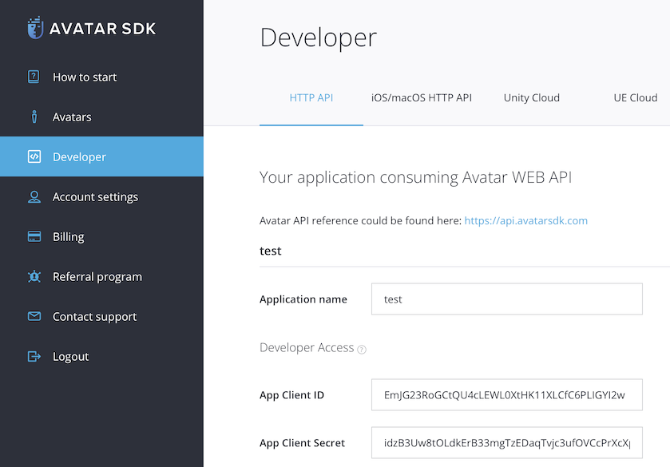

# MetaPerson - VR Oculus Quest Sample
This sample demonstrates how to embed the [MetaPerson Creator](https://metaperson.avatarsdk.com/) into Oculus Quest VR applications and export an avatar from it.
There are two ways of the integration. 
1. Showing the [MetaPerson Creator](https://metaperson.avatarsdk.com/) in a Web View component. 
There is no default Unity Web View control for Oculus Quest applications. So you should use any of the 3rd party solutions.
We recommend using a [Vuplex Web View](https://store.vuplex.com/webview/android-gecko) plugin that is paid.

2. Installing a [MetaPerson Creator android application](https://metaperson.avatarsdk.com/apps/android/com.itseez3d.metaperson.creator.1.5.0.apk) 
This application has similar features to the [MetaPerson Creator](https://metaperson.avatarsdk.com/) and can be run from your application instead of showing a web page.
The application is not available in the Oculus Quest Store for now and is destributed as an APK file. So this way best suits for evaluation and testing purposes while you didn't implement a solution with a Web View.

## Getting Started.
You need to complete the following steps before experimenting with this sample:

* Get an AvatarSDK developer account at https://accounts.avatarsdk.com/developer/signup/
* Create an application with Client credentials Authorization Grant at https://accounts.avatarsdk.com/developer/
* Copy `App Client ID` and `App Client Secret` from the Client Access application at https://accounts.avatarsdk.com/developer/

Now you are ready to go:
* Clone this repository to your computer
* Open the project in Unity 2021.3.19f1 or above.
* Open an `Assets/AvatarSDK/MetaPerson/VRQuestSample/Scenes/VRQuestMetaPersonSample.unity` scene.
* Find a `SceneHandler` object in the `Hierarchy`, provide `Client Id` and `Client Secret` to `Account Credentials` component.

* Import the [Vuplex Web View for Android with Gecko Engine](https://store.vuplex.com/webview/android-gecko) plugin if you have it.
* Install the [MetaPerson Creator android application](https://metaperson.avatarsdk.com/apps/android/com.itseez3d.metaperson.creator.1.5.0.apk) if you are going to use it.
* Build and run a Quest application with the `Assets/AvatarSDK/MetaPerson/VRQuestSample/Scenes/VRQuestMetaPersonSample.unity` scene.

Inside the application:
* Press the `Show Web Page` button to show [MetaPerson Creator](https://metaperson.avatarsdk.com/) page if you have imported the [Vuplex Web View](https://store.vuplex.com/webview/android-gecko) plugin.
* Or you can run the [MetaPerson Creator android application](https://metaperson.avatarsdk.com/apps/android/com.itseez3d.metaperson.creator.1.5.0.apk) by pressing the `Run Application` button.

* You can select any of sample models or create your own personal avatar.
* Once you finished an avatar's customization, press an `Export` button to download it and show in the VR sample scene.
