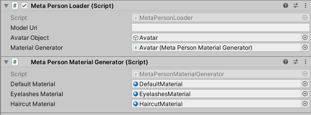

# MetaPerson - VR Oculus Quest Sample
This sample demonstrates how to embed the [MetaPerson Creator](https://metaperson.avatarsdk.com/) into Oculus Quest VR applications and export an avatar from it.
There are two ways of integration. 
1. Showing the [MetaPerson Creator](https://metaperson.avatarsdk.com/) in a Web View component.<br/>
There is no default Unity Web View control for Oculus Quest applications. So you should use any of the 3rd party solutions.
We recommend using a [Vuplex Web View](https://store.vuplex.com/webview/android-gecko) plugin that is paid.

2. Installing a [MetaPerson Creator android application](https://metaperson.avatarsdk.com/apps/android/com.itseez3d.metaperson.creator.1.5.0.apk)<br/>
This application has similar features to the [MetaPerson Creator](https://metaperson.avatarsdk.com/) and can be run from your application instead of showing a web page.
The application is not available in the Oculus Quest Store for now and is distributed as an APK file. So this way best suited for evaluation and testing purposes while you didn't implement a solution with a Web View.

## Getting Started.
You need to complete the following steps before experimenting with this sample:

* Get an AvatarSDK developer account at https://accounts.avatarsdk.com/developer/signup/
* Create an application with Client credentials Authorization Grant at https://accounts.avatarsdk.com/developer/
* Copy `App Client ID` and `App Client Secret` from the Client Access application at https://accounts.avatarsdk.com/developer/


Now you are ready to go:
* Clone this repository to your computer
* Open the project in Unity 2021.3.19f1 or above.
* Open an `Assets/AvatarSDK/MetaPerson/VRQuestSample/Scenes/VRQuestMetaPersonSample.unity` scene.
* Find a `SceneHandler` object in the `Hierarchy` and provide `Client Id` and `Client Secret` to `Account Credentials` component.

* Import the [Vuplex Web View for Android with Gecko Engine](https://store.vuplex.com/webview/android-gecko) plugin if you have it.
* Install the [MetaPerson Creator android application](https://metaperson.avatarsdk.com/apps/android/com.itseez3d.metaperson.creator.1.5.0.apk) if you are going to use it.
* Build and run a Quest application with the `Assets/AvatarSDK/MetaPerson/VRQuestSample/Scenes/VRQuestMetaPersonSample.unity` scene.

Inside the application:
* Press the `Show Web Page` button to show [MetaPerson Creator](https://metaperson.avatarsdk.com/) page if you have imported the [Vuplex Web View](https://store.vuplex.com/webview/android-gecko) plugin.
* Or you can run the [MetaPerson Creator android application](https://metaperson.avatarsdk.com/apps/android/com.itseez3d.metaperson.creator.1.5.0.apk) by pressing the `Run Application` button.

* You can select any of the sample models or create a personal avatar.
* Once you finished an avatar's customization, press the `Export` button to download it and show it in the VR sample scene.


## How It Works
### Importing Avatar From Web Page
[MetaPerson Creator](https://metaperson.avatarsdk.com/) page can be shown in a Web View component. This samples uses the [Vuplex Web View](https://store.vuplex.com/webview/android-gecko). 
You can use any other Web View component that best suits you.
* Load the following page in a Web View: https://metaperson.avatarsdk.com/iframe.html
* Before the page is loaded this Java Script code should be executed. It subscribes to some events and posts messages with authentication and export parameters.
```js
const CLIENT_ID = "your_client_id";
const CLIENT_SECRET = "your_client_secret";

function onWindowMessage(evt) {
	if (evt.type === 'message') {
		if (evt.data?.source === 'metaperson_editor') {
			let data = evt.data;
			let evtName = data?.eventName;
			if (evtName === 'unity_loaded') {
				onUnityLoaded(evt, data);
			} else if (evtName === 'model_exported') {
				console.log('model url: ' + data.url);
				window.vuplex.postMessage(evt.data);
			}
		}
	}
}

function onUnityLoaded(evt, data) {
	let authenticationMessage = {
		'eventName': 'authenticate',
		'clientId': CLIENT_ID,
		'clientSecret': CLIENT_SECRET,
		'exportTemplateCode': '',
	};
	window.postMessage(authenticationMessage, '*');

	let exportParametersMessage = {
		'eventName': 'set_export_parameters',
		'format': 'glb',
		'lod': 2,
		'textureProfile': '1K.jpg'
	};
	evt.source.postMessage(exportParametersMessage, '*');
}

window.addEventListener('message', onWindowMessage);
```
* Client credentials and [export parameters](#export-parameters) are specified in the `onUnityLoaded` method.
* `onWindowMessage` method is executed when the [MetaPerson Creator](https://metaperson.avatarsdk.com/) page sends messages.
* When an avatar model is exported, the corresponding `model_exported` event is received with a URL of this model. 
* [Model Loader](#model-loader) is used to load the model by its URL and display it in the scene.

[See more information about JS API](https://docs.metaperson.avatarsdk.com/js_api.html)

Implementation details can be found in the [MPCWebPageUsageSample.cs script](./Assets/AvatarSDK/MetaPerson/VRQuestSample/Scripts/MPCWebPageUsageSample.cs).

### Importing Avatar From MetaPerson Creator App
The [MetaPerson Creator android application](https://metaperson.avatarsdk.com/apps/android/com.itseez3d.metaperson.creator.1.5.0.apk) should be installed on an Oculus device.<br/>
Communication between a VR application and the [MetaPerson Creator](https://metaperson.avatarsdk.com/apps/android/com.itseez3d.metaperson.creator.1.5.0.apk) is performed by using [deep links](https://docs.unity3d.com/Manual/deep-linking.html).
* Use the following code to run the [MetaPerson Creator app](https://metaperson.avatarsdk.com/apps/android/com.itseez3d.metaperson.creator.1.5.0.apk). The deep link contains client credentials and [export parameters](#export-parameters).
```c#
Application.OpenURL("metaperson://get_avatar?clientId=your_client_id&clientSecret=your_client_secret&format=glb&lod=2&textureProfile=1K.jpg");
```
* Once an avatar model is exported, your VR application will be opened with the following deep link.<br/>
`metaperson://share_avatar?model_link`

* To open such URL types, your application should declare it in the [AndroidManifest.xml](./Assets/Plugins/Android/AndroidManifest.xml)
```xml
<intent-filter>
	...
	<data android:scheme="metaperson" android:host="share_avatar" />
</intent-filter>
```
* [Model Loader](#model-loader) is used to load the model by its URL and display it in the scene.

Implementation details can be found in the [MPCAppUsageSample.cs script](./Assets/AvatarSDK/MetaPerson/VRQuestSample/Scripts/MPCAppUsageSample.cs).

### Export Parameters
Export parameters allow you to customize the output of the exported avatar by specifying textures resolution, mesh format, and level of detail.
* **format** - specifies the mesh format of the exported avatar. Supported formats: **gltf**, **glb**, **fbx**.
* **lod** - specifies the level of detail (LOD) for the exported avatar mesh. The higher the value, the less detailed mesh. Possible values: **1** and **2**.
* **textureProfile** - specifies the texture profile for the exported avatar (textures resolution and format). Possible values: **4K.png**, **2K.png**, **1K.png**, **4K.jpg**, **2K.jpg**, **1K.jpg**,
**4K.webp**, **2K.webp**, **1K.webp**.

## Model Loader
This sample exports avatars in **GLB** format and uses the [glTFast](https://github.com/atteneder/glTFast) plugin to load models.<br/> 
The exported model URL contains a link to a ZIP archive. So the archive is extracted before the model is loaded.<br/>
### Materials
The [MetaPersonMaterialGenerator](./Assets/AvatarSDK/MetaPerson/ModelLoader/Scripts/MetaPersonMaterialGenerator.cs) object configures the avatar's materials. 
Specific materials are used for `haircuts` and `eyelashes`, other meshes are rendered with the `DefaultMaterial`.<br/>
<br/>
You can extend this class for your needs.

## Support
If you have any questions or issues with the plugin, please contact us <support@avatarsdk.com>.
