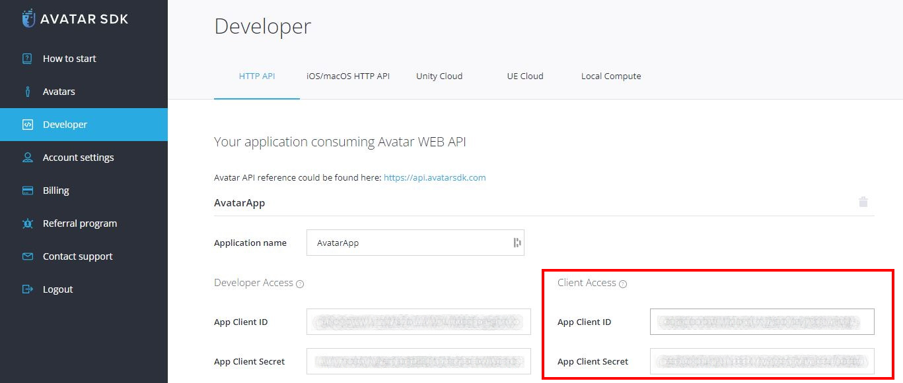
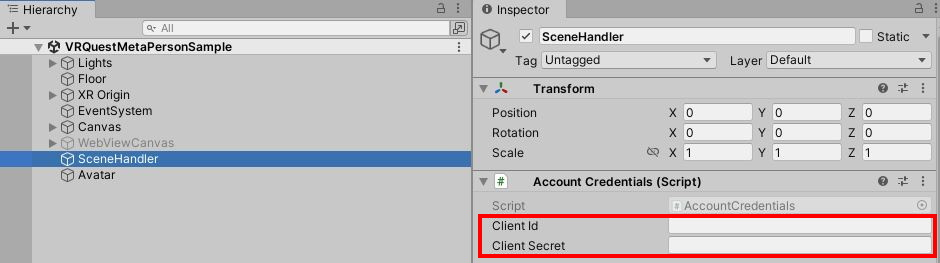
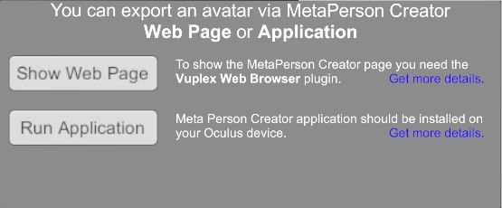

# MetaPerson - VR Oculus Quest Sample
This sample demonstrates how to integrate the [MetaPerson Creator](https://metaperson.avatarsdk.com/) web page into **Oculus Quest** VR applications and export an avatar from it.

### Integration Methods
There are two ways to integrate the [MetaPerson Creator](https://metaperson.avatarsdk.com/) into your Oculus Quest VR application:

**1. Showing the [MetaPerson Creator](https://metaperson.avatarsdk.com/) in a Web View component.**

To display the [MetaPerson Creator](https://metaperson.avatarsdk.com/) web page within your application, you can use a Web View component. 
However, Unity does not provide a built-in Web View control for Oculus Quest applications, so you'll need to use a 3rd-party solution.

We recommend using the [Vuplex Web View](https://store.vuplex.com/webview/android-gecko) plugin, which is a paid solution.

**2. Installing a [MetaPerson Creator Android application](https://metaperson.avatarsdk.com/apps/android/com.itseez3d.metaperson.creator.1.9.0.apk)**

An alternative approach is to install the [MetaPerson Creator Android application](https://metaperson.avatarsdk.com/apps/android/com.itseez3d.metaperson.creator.1.9.0.apk) directly on the Oculus Quest device. 
This application offers similar features to the web-based [MetaPerson Creator](https://metaperson.avatarsdk.com/) and can be run from your application, eliminating the need for a Web View component.

**Note:** As of now, the [MetaPerson Creator Android application](https://metaperson.avatarsdk.com/apps/android/com.itseez3d.metaperson.creator.1.9.0.apk) is not available in the Oculus Quest Store and is distributed as an APK file. 
This method is ideal for evaluation and testing purposes, especially if you haven't implemented a solution using a Web View.

## Getting Started.

### Account Credentials
First, you need AvatarSDK developer account credentials to export models from the [MetaPerson Creator](https://metaperson.avatarsdk.com/). 

Follow these steps to obtain them:

1. **Create an AvatarSDK Developer Account.**
   Visit the [AvatarSDK Developer Signup page](https://accounts.avatarsdk.com/developer/signup/) to create your AvatarSDK developer account. If you already have an account, you can skip this step.

2. **Create an Application.**
   After successfully registering or logging in to your AvatarSDK developer account, go to the [Developer Dashboard](https://accounts.avatarsdk.com/developer/). Here, create a new application. 

3. **Retrieve Your App Client ID and App Client Secret.**
   Once your application is created, you can obtain your **App Client ID** and **App Client Secret** from the Developer Dashboard.


### Run Sample

1. Clone this repository to your computer

2. Open the project in Unity 2021.3.19f1 or above.

3. Open the scene:
`Assets/AvatarSDK/MetaPerson/VRQuestIntegrationSample/Scenes/MetaPersonCreatorVRQuestIntegrationSample.unity`

4. Find a `SceneHandler` object in the `Hierarchy` and provide `Client Id` and `Client Secret` to `Account Credentials` component.


5. Import the [Vuplex Web View for Android with Gecko Engine](https://store.vuplex.com/webview/android-gecko) plugin if you have it.

6. Install the [MetaPerson Creator Android application](https://metaperson.avatarsdk.com/apps/android/com.itseez3d.metaperson.creator.1.9.0.apk) if you are going to use it.

7. Build and run a Quest application with the `Assets/AvatarSDK/MetaPerson/VRQuestIntegrationSample/Scenes/MetaPersonCreatorVRQuestIntegrationSample.unity` scene.

### Importing Model Into Application
1. Press the `Show Web Page` button to show the [MetaPerson Creator](https://metaperson.avatarsdk.com/) page if you have imported the [Vuplex Web View](https://store.vuplex.com/webview/android-gecko) plugin.

2. Or you can run the [MetaPerson Creator Android application](https://metaperson.avatarsdk.com/apps/android/com.itseez3d.metaperson.creator.1.9.0.apk) by pressing the `Run Application` button.


3. Select any of the sample models or create a your own avatar.

4. Once you completed avatar customization, press the `Export` button to download it and show it in the VR sample scene.


## How It Works

### Importing Avatar From Web Page
To integrate the [MetaPerson Creator](https://metaperson.avatarsdk.com/iframe.html) page into VR Quest application, it should be shown in a WebView component. 
This sample uses the [Vuplex Web View](https://store.vuplex.com/webview/android-gecko) for this purpose.

The communication between [MetaPerson Creator](https://metaperson.avatarsdk.com/iframe.html) and Unity is carried out through the use of the [JS API](https://docs.metaperson.avatarsdk.com/js_api.html).

Here's how it works:

1. Load the following page in a WebView component: `https://metaperson.avatarsdk.com/iframe.html`.

2. Prior to loading the page, execute the following JavaScript code. This code subscribes to events from the [MetaPerson Creator](https://metaperson.avatarsdk.com/iframe.html) page and posts messages with authentication, export, and UI parameters:
```js
const CLIENT_ID = "your_client_id";
const CLIENT_SECRET = "your_client_secret";

function onWindowMessage(evt) {
	if (evt.type === 'message') {
		if (evt.data?.source === 'metaperson_creator') {
			let data = evt.data;
			let evtName = data?.eventName;
			if (evtName === 'unity_loaded') {
				onUnityLoaded(evt, data);
			} else if (evtName === 'model_exported') {
				console.log('model url: ' + data.url);
				console.log('gender: ' + data.gender);
				window.vuplex.postMessage(evt.data);
			}
		}
	}
}

function onUnityLoaded(evt, data) {
	let authenticationMessage = {
		'eventName': 'authenticate',
		'clientId': CLIENT_ID,
		'clientSecret': CLIENT_SECRET
	};
	window.postMessage(authenticationMessage, '*');

	let exportParametersMessage = {
		'eventName': 'set_export_parameters',
		'format': 'glb',
		'lod': 2,
		'textureProfile': '1K.jpg'
	};
	evt.source.postMessage(exportParametersMessage, '*');
	
	let uiParametersMessage = {
		'eventName': 'set_ui_parameters',
		'isExportButtonVisible' : true,
		'closeExportDialogWhenExportComlpeted' : true,
	};
	evt.source.postMessage(uiParametersMessage, '*');
}

window.addEventListener('message', onWindowMessage);
```

* The **onUnityLoaded** method sets your client credentials and [export parameters](#js-api-parameters).
* The **onWindowMessage** method handles messages received from the [MetaPerson Creator](https://metaperson.avatarsdk.com/iframe.html) page.
* When an avatar model is exported, the corresponding **model_exported** event is received, including the URL of the model and its gender.
* Upon receiving the **model_exported** event, the model is loaded into the scene using its URL.

[See more information about JS API](https://docs.metaperson.avatarsdk.com/js_api.html)

Implementation details can be found in the [MPCWebPageUsageSample.cs script](./Assets/AvatarSDK/MetaPerson/VRQuestSample/Scripts/MPCWebPageUsageSample.cs).

### Importing Avatar From MetaPerson Creator App
The [MetaPerson Creator Android application](https://metaperson.avatarsdk.com/apps/android/com.itseez3d.metaperson.creator.1.9.0.apk) should be installed on an Oculus device.<br/>
Communication between a VR application and the [MetaPerson Creator](https://metaperson.avatarsdk.com/apps/android/com.itseez3d.metaperson.creator.1.9.0.apk) is performed by using [deep links](https://docs.unity3d.com/Manual/deep-linking.html).
* Use the following code to run the [MetaPerson Creator app](https://metaperson.avatarsdk.com/apps/android/com.itseez3d.metaperson.creator.1.9.0.apk). The deep link contains client credentials and [export parameters](#export-parameters).
```c#
Application.OpenURL("metaperson://get_avatar?clientId=your_client_id&clientSecret=your_client_secret&format=glb&lod=2&textureProfile=1K.jpg");
```
* Once an avatar model is exported, your VR application will be opened with the following deep link.<br/>
`metaperson://share_avatar?model_link`

* To open such URL types, your application should declare it in the [AndroidManifest.xml](./Assets/Plugins/Android/AndroidManifest.xml)
```xml
<intent-filter>
	...
	<data android:scheme="metaperson" android:host="share_avatar" />
</intent-filter>
```
* [Model Loader](#model-loader) is used to load the model by its URL and display it in the scene.

Implementation details can be found in the [MPCAppUsageSample.cs script](./Assets/AvatarSDK/MetaPerson/VRQuestSample/Scripts/MPCAppUsageSample.cs).

### Export Parameters
Export parameters allow you to customize the output of the exported avatar by specifying textures resolution, mesh format, and level of detail.
* **format** - specifies the mesh format of the exported avatar. Supported formats: **gltf**, **glb**, **fbx**.
* **lod** - specifies the level of detail (LOD) for the exported avatar mesh. The higher the value, the less detailed mesh. Possible values: **1** and **2**.
* **textureProfile** - specifies the texture profile for the exported avatar (textures resolution and format). Possible values: **4K.png**, **2K.png**, **1K.png**, **4K.jpg**, **2K.jpg**, **1K.jpg**,
**4K.webp**, **2K.webp**, **1K.webp**.

## Model Loader
This sample uses [MetaPerson Loader](https://github.com/avatarsdk/metaperson-loader-unity) to show avatar model on the scene.

## Support
If you have any questions or issues with the plugin, please contact us <support@avatarsdk.com>.
